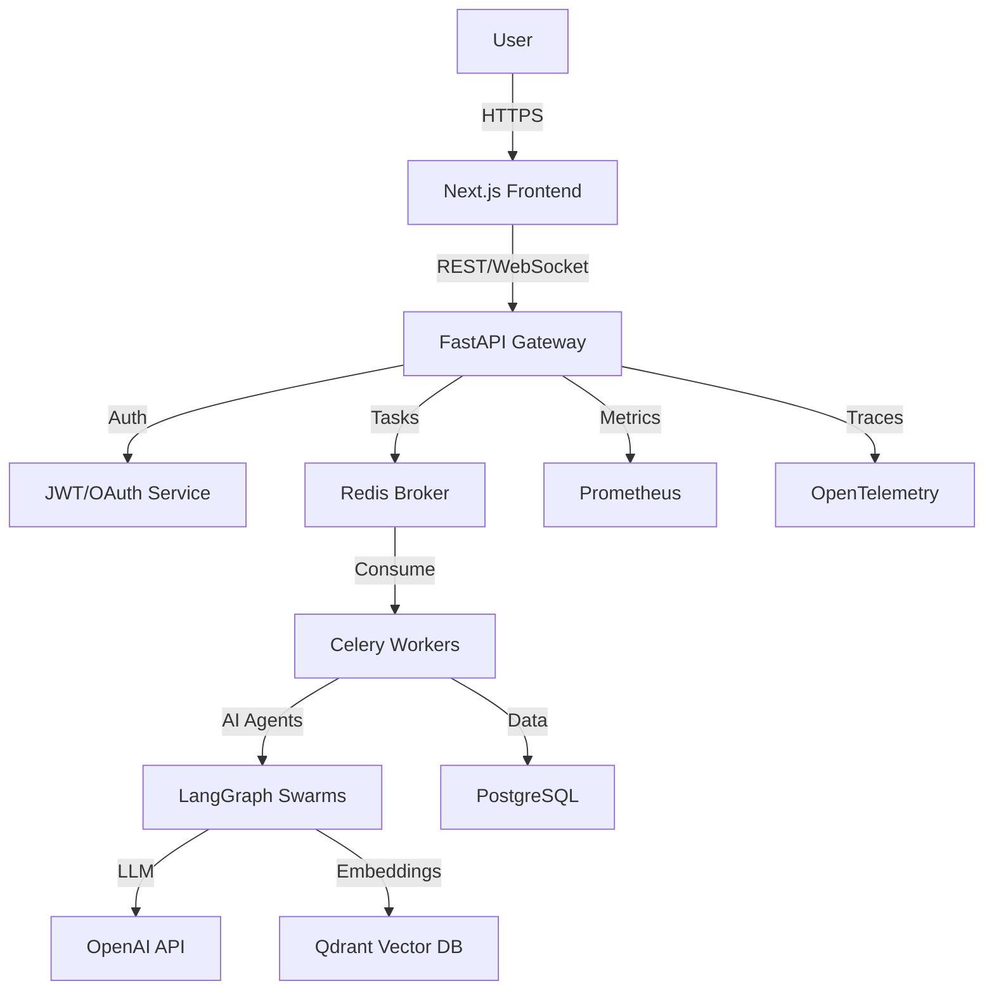

# DevVerse AI 🚀

**The Ultimate AI-Powered Developer Platform for Gen-Z Builders**

DevVerse AI is a production-grade SaaS platform that combines AI agents, distributed systems, and recommendation engines to supercharge developers' careers. Whether you're building your GitHub twin, getting your code roasted, finding open-source projects, or hunting for hackathon teammates, DevVerse has you covered.


---

## 🌟 Key Features

### 1. 🧬 AI GitHub Twin
Connect your GitHub account and let our **GitHub Analyzer Agent** build your digital DNA.
- **Deep Analysis**: Scans repos, commits, PRs, and coding patterns.
- **Developer DNA**: Generates a structured JSON profile with skills, strengths, weaknesses, and engineering style.
- **Personalized Roadmap**: Recommends specific learning paths based on your gaps.

### 2. 🔥 AI Code Roast
Get brutal honesty or professional feedback on your codebase.
- **4-Agent Swarm**: Architecture, Security, Performance, and Roast Generator agents work in parallel.
- **Dual Modes**: Switch between "Professional Review" (constructive) and "Gen-Z Roast" (funny & savage).
- **Actionable Insights**: Detailed reports on security vulnerabilities, architectural flaws, and performance bottlenecks.

### 3. 🤝 AI Open Source Matchmaker
Stop scrolling GitHub issues. Let AI find the perfect contribution for you.
- **Semantic Search**: RAG pipeline with Qdrant vector DB matches your skills to project needs.
- **Smart Ranking**: Considers difficulty, tech stack, and your career goals.
- **Contribution Roadmap**: Suggests the exact first issue to tackle and how to get started.

### 4. ⚡ AI Hackathon Partner Finder
Build your dream team in seconds.
- **Compatibility Scoring**: Algorithm matches based on complementary skills, timezone, and availability.
- **Role Balancing**: Ensures your team has the right mix of frontend, backend, design, and pitch skills.
- **Idea Generation**: AI suggests project ideas based on team strengths.

---

## 🏗️ Architecture

DevVerse is built on a scalable, event-driven microservices architecture.



### Tech Stack

| Layer | Technologies |
| :--- | :--- |
| **Backend** | Python 3.12, FastAPI, SQLAlchemy 2.0, Pydantic, Celery |
| **AI/ML** | LangGraph, OpenAI API, RAG, Qdrant, Semantic Search |
| **Frontend** | Next.js 14, TypeScript, Tailwind CSS, Shadcn UI |
| **Database** | PostgreSQL (Relational), Qdrant (Vector), Redis (Cache/Broker) |
| **Infra** | Docker, Kubernetes, Helm, Terraform (AWS) |
| **Observability** | Prometheus, Grafana, OpenTelemetry, Jaeger |
| **CI/CD** | GitHub Actions, Docker Registry, ArgoCD-ready |

---

## 🚀 Quick Start

### Prerequisites
- Docker & Docker Compose
- Python 3.12+ (for local dev without Docker)
- Node.js 20+ (for frontend dev)
- AWS Account (for deployment)

### 1. Local Development (Docker Compose)

Spin up the entire stack (DB, Redis, Qdrant, Backend, Frontend) in one command:

```bash
# Clone the repo
git clone https://github.com/Maherimtiyaz/Dev-Verse
cd devverse-ai

# Copy environment variables
cp .env.example .env

# Start all services
docker-compose up --build
```

Access the services:
- **Frontend**: http://localhost:3000
- **API Docs**: http://localhost:8000/docs
- **Grafana**: http://localhost:3001 (admin/admin)

### 2. Manual Setup (Backend)

```bash
cd backend
python -m venv venv
source venv/bin/activate
pip install -r requirements.txt

# Run migrations
alembic upgrade head

# Start server
uvicorn main:app --reload
```

### 3. Manual Setup (Frontend)

```bash
cd frontend
npm install
npm run dev
```

---

## ☁️ Deployment to AWS

DevVerse uses **Terraform** to provision production infrastructure on AWS.

### Infrastructure Components
- **EKS**: Managed Kubernetes cluster for app deployment.
- **RDS**: Multi-AZ PostgreSQL database.
- **ElastiCache**: Redis serverless for caching and Celery broker.
- **ECR**: Private container registry.
- **S3**: Storage for artifacts and logs.
- **VPC**: Secure networking with public/private subnets.

### Deploy Steps

```bash
cd terraform

# Initialize Terraform
terraform init

# Review plan
terraform plan -var-file="prod.tfvars"

# Apply infrastructure
terraform apply -var-file="prod.tfvars"

# Configure kubectl
aws eks update-kubeconfig --region <region> --name <cluster-name>

# Deploy App via Helm
helm install devverse ./charts/devverse -f values/prod.yaml
```

---

## 🧪 Testing

We prioritize reliability with a comprehensive test suite.

### Backend Tests
Uses `pytest` with `TestContainers` for real integration testing.

```bash
cd backend
pytest --cov=app --cov-report=html
```

### Frontend Tests
Uses `Jest` and `React Testing Library`.

```bash
cd frontend
npm test
```

### CI/CD
GitHub Actions automatically runs linting, tests, and security scans on every PR.

---

## 📊 Observability

Built-in monitoring ensures high reliability.

- **Metrics**: Prometheus scrapes metrics from API, Celery, and DB.
- **Dashboards**: Pre-configured Grafana dashboards for latency, errors, and throughput.
- **Tracing**: OpenTelemetry exports traces to Jaeger for distributed debugging.
- **Logging**: Structured JSON logs with correlation IDs for easy tracing.

Access Grafana at `http://localhost:3001` to view the "DevVerse Overview" dashboard.

---

## 🔒 Security

- **Authentication**: JWT-based auth with refresh tokens + GitHub OAuth (PKCE).
- **Authorization**: Role-Based Access Control (RBAC) for users and admins.
- **Secrets Management**: AWS Secrets Manager integration for production.
- **Rate Limiting**: Redis-backed rate limiting to prevent abuse.
- **Input Validation**: Strict Pydantic models for all API inputs.

---

## 📂 Project Structure

```
devverse-ai/
├── backend/                # FastAPI Application
│   ├── api/                # REST & WebSocket Routes
│   ├── agents/             # LangGraph AI Agents
│   ├── core/               # Config, Security, Logging
│   ├── db/                 # Database Models & Sessions
│   ├── services/           # Business Logic & RAG
│   ├── tasks/              # Celery Background Jobs
│   └── tests/              # Pytest Suite
├── frontend/               # Next.js Application
│   ├── src/app/            # Pages & Routing
│   ├── src/components/     # UI Components
│   └── src/lib/            # API Client & Utils
├── infrastructure/         # IaC
│   ├── k8s/                # Kubernetes Manifests
│   ├── charts/             # Helm Charts
│   └── terraform/          # AWS Terraform Modules
├── observability/          # Monitoring Stack
│   ├── prometheus/         # Config & Rules
│   ├── grafana/            # Dashboards & Datasources
│   └── otel/               # OpenTelemetry Config
├── .github/workflows/      # CI/CD Pipelines
├── docker-compose.yml      # Local Dev Orchestration
└── README.md
```

---

## 🤝 Contributing

We welcome contributions! Please see our [Contributing Guide](CONTRIBUTING.md) for details.

1. Fork the repo
2. Create a feature branch (`git checkout -b feature/amazing-feature`)
3. Commit your changes (`git commit -m 'Add amazing feature'`)
4. Push to the branch (`git push origin feature/amazing-feature`)
5. Open a Pull Request

---

## 📄 License

This project is licensed under the MIT License - see the [LICENSE](LICENSE) file for details.

---

## 🙌 Acknowledgments

- Built with ❤️ by the DevVerse Team
- Powered by **LangGraph**, **FastAPI**, and **Next.js**
- Inspired by the open-source community

---

**Ready to build?** Join the revolution at [DevVerse AI](#).
